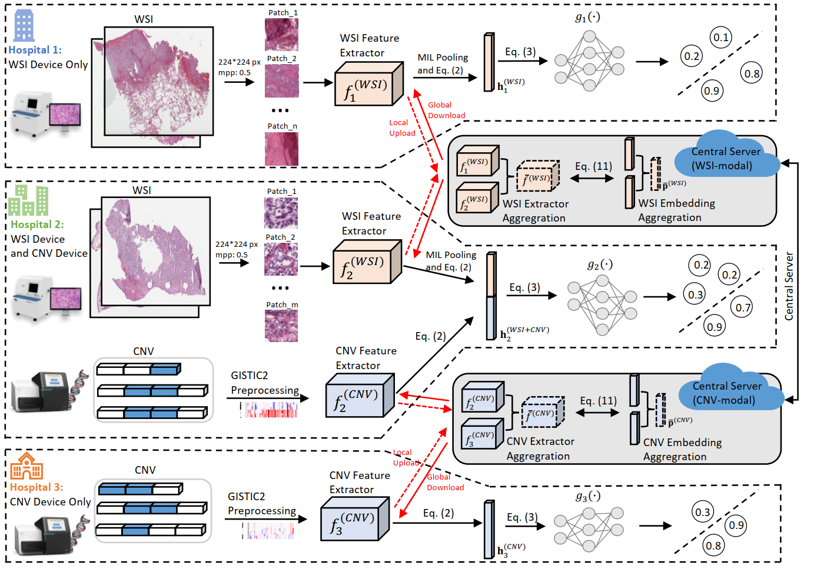

# FedMM: A PyTorch Implementation for Federated Multi-Modal Learning in Computational Pathology

## Overview
The FedMM framework aims to address the challenges of privacy and modality heterogeneity in computational pathology. This implementation is based on the paper "FedMM: Federated Multi-Modal Learning with Modality Heterogeneity in Computational Pathology."

## Key Features
- **Privacy-Preserving**: No need to access users' raw data, mitigating privacy risks.
- **Heterogeneous Modalities**: Designed to handle Heterogeneous (and possibly overlapping) data modalities across clients.
- **Local Inference**: Clients can locally extract features and perform classifications, reducing the need for centralized computation.
- **Improved Generalization**: Trains federated feature extractors on distributed data, enhancing generalizability.


## Installation Steps

### Prerequisites
- Install [PyTorch](https://pytorch.org/get-started/locally/)
- Install [Anaconda/Miniconda](https://docs.conda.io/projects/miniconda/en/latest/)
- Install [OpenSlide and openslide-python](https://pypi.org/project/openslide-python/)

### Required Packages
```bash
$ conda env create --name FedMM --file env.yml
$ conda activate FedMM
```

### Openslide Tutorials
- [Tutorial](https://openslide.org/)

## Processing

### Processing Raw WSI Data

#### Downloading WSI Data From GDC Data Portal
  - Use [GDC data portal](https://docs.gdc.cancer.gov/Data_Transfer_Tool/Users_Guide/Getting_Started/) with a manifest file and a configuration file. Note: downloading raw WSIs may take several days and ~5TB of disk space.
  - Refer to [TCGA data portal documentation](https://docs.gdc.cancer.gov/Data_Transfer_Tool/Users_Guide/Getting_Started/) for more details.

#### Preparing Patches
- [OpenSlide](https://openslide.org/), a C library with [Python API](https://pypi.org/project/openslide-python/), is used for reading WSI data.
- Refer the [OpenSlide Python API documentation](https://openslide.org/api/python/) for details.

## Data Folder Structure
```bash
tcga_wsi_data (distributed to three hospitals)
|-- wsi_nsclc 
|   |-- luad
|   |-- lusc
|-- wsi_rcc 
|   |-- kirc
|   |-- kirp
|-- features_0725_2023 (Each csv represents a WSI, rows in csv represent different instances or patches)
|   |-- TCGA-22-5480-01Z-00-DX1.csv
|   |-- ...
|-- label.csv (labels)
tcga_cnv_data (distributed to three hospitals)
|-- wsi_nsclc 
|   |-- luad
|   |-- lusc
|-- wsi_rcc 
|   |-- kirc
|   |-- kirp
|-- features_0802_2023
|   |-- TCGA-22-5480-01Z-00-DX1.csv
|   |-- ...
|-- label.csv (labels)
```
